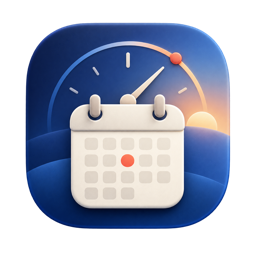

<p align="center">
  
</p>

# Date Day

Date Day is a menu-bar app for macOS 26 or later. It shows the current weekday
and date. It can also show up to three clocks for selected time zones.

Date Day follows the system locale by default. You can select a different
locale in the app settings.

Examples:

- US English: `Thu 12/31/2026`
- British English: `Thu 31/12/2026`
- Chinese: `四 2026-12-31`

## Features

- Display a locale-aware weekday and date in the menu bar.
- Override the system locale with US English, British English, Simplified
  Chinese, or Traditional Chinese.
- Show one to three clocks to the left of the date.
- Keep the first clock linked to the system time zone and show it in bold.
- Select time zones and custom labels for two additional clocks.
- Start the app when you log in.

Date Day uses the Gregorian calendar. Chinese locales use a compact,
one-character weekday.

## Requirements

- macOS 26 or later
- Xcode 26 or later
- [XcodeGen](https://github.com/yonaskolb/XcodeGen)

## Build and run

Generate the Xcode project, run the tests, and build the Release app:

```sh
xcodegen generate
xcodebuild -project DateDay.xcodeproj -scheme DateDay \
  -destination 'platform=macOS' \
  -derivedDataPath .derived-data test
xcodebuild -project DateDay.xcodeproj -scheme DateDay \
  -configuration Release \
  -destination 'platform=macOS' \
  -derivedDataPath .derived-data build
open .derived-data/Build/Products/Release/DateDay.app
```

Date Day is a menu-bar-only app, so it does not show an icon in the Dock. Click
the date in the menu bar to open its menu and settings.

## App icon assets

The source artwork is in `Artwork`. To regenerate all macOS app icon sizes,
run:

```sh
scripts/generate_app_icons.sh
```
